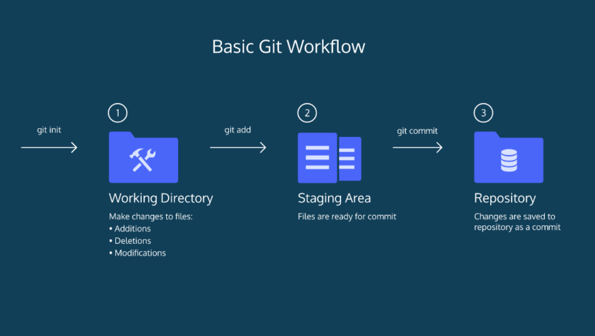
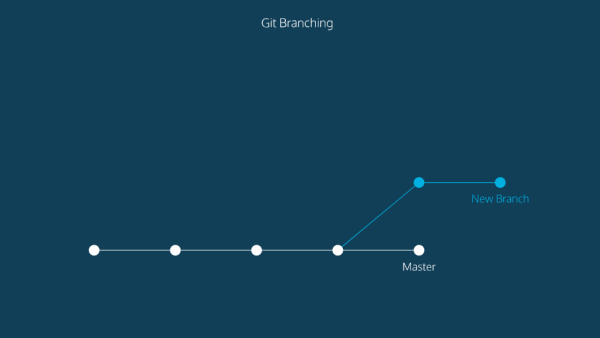
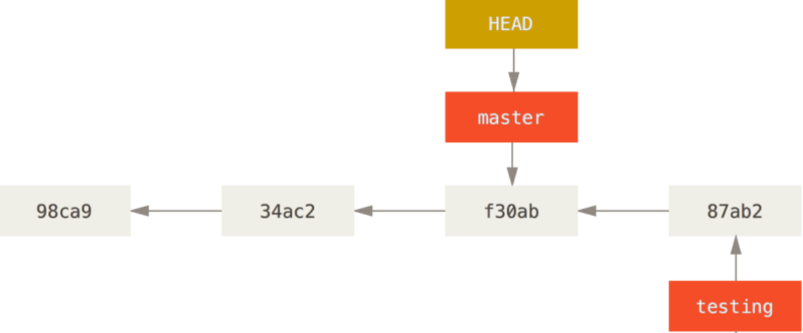

# GIT

Git is a free and open source distributed version control system designed to handle everything from small to very large projects with speed and efficiency.

### BASIC GIT WORK FLOW 

* **git init** creates a new Git repository.This creates a new subdirectory named *.git* that contains all of your necessary repository files — a Git repository skeleton.
* **git status** inspects the contents of the working directory and staging area.
* **git add** adds files from the working directory to the staging area.
* **git diff** shows the difference between the working directory and the staging area.
* **git diff --staged** or **git diff --cached** compares your staged changes to your last commit.
* **git commit -m ''** permanently stores file changes from the staging area in the repository.
* **git commit -v** same the commend above(git commit -m)  you can see exactly what changes you’re committing more.  
* **git log** shows a list of all previous commits.
* **git log -p** You can also limit the number of log entries displayed, such as using -2 to show only the last two entries.(git log -p -2)

### First Exercise

1. Run **mkdir (repo name)**   &emsp;&emsp;  give repo name = famous
2. Run **cd famous**           &emsp;&emsp;     cd (change directory) 
3. Run **git init**            &emsp;&emsp;     to make git repo
4. Run  **touch people.txt**    &emsp;&emsp;    touch to make a file 
5. Run **ls** or **ls -a** **ls -l**    &emsp;&emsp;  see differences
6. Time to add some text to **people.txt** file [click here](mostknown.html) add just **Elon Musk's** info 
7. There are several ways to open file via terminal (nano filename,gedit filename etc..) Lets use run **gedit filename**
8. Run **git status** &emsp;&emsp; check to what happens you might see with red color file name 
9. Run **git add people.txt**  then run **git status** you might see (new file:   people.txt ) in green color 
10. Run **git commit -m 'add Elon Musk info and first commit'**
11. Add another text [click here](mostknown.html.php) add just **Jeff Bezos** info.
12. Run **git diff** see the difference between working directory and staging area then add file to staging area
13. After git add, run **git commit -m 'add Jeff Bezos info and second commit'**
14. Run **git log**  viewing the commit history,  extra and better command(**git log --oneline**).If your cursor gets stuck in “git log” mode in the terminal, press “**q**” on your keyboard to escape.
15. Run **history** command to show you all of the last commands that have been recently used.

* Well done FIRST exercise is done. Are you ready for next exercises?? :)))

### BACKTRACK  IN GIT

When working on a Git project, sometimes we make changes that we want to get rid of. We can absolutely do it with Git.

Before we dive into backtracking flow we need to know what HEAD is.In Git, the commit you are currently on is known as the **HEAD** commit. In other words HEAD is a reference to the last commit in the currently check-out branch.
To see HEAD commit run **git show HEAD**.

* **git checkout HEAD** or **git checkout** (filename),  will restore the file in your working directory to look exactly as it did when you last made a commit. Be careful for this command.
* **git reset HEAD** (filename), this command resets the file in the staging area to be the same as the **HEAD** commit. It does not discard file changes from the working directory.
* **git reset** (commit_SHA), resets to a previous commit in your commit history.This command works by using the first 7 characters of the SHA of a previous commit( use **git log** to reach all commits).
* **git commit --amend** change the most recent commit message.

### Second Exercise

1. Run **git show HEAD**.
2. Add text [click here](mostknown.html) add just **Mark Zuckerberg** info.
3. Run **git checkout HEAD people.txt** your working directory will be same as last commit.
4. Add text [click_here](mostknown.html) add just **Mark Zuckerberg** info than add to staging area(**git add poeple.txt**).
5. Run **git reset HEAD people.txt**, it will make unstage that file from the staging area but does not discard file changes from the working directory.
6. Run **git add people.txt** .
7. Run **git commit -m 'add Mark Zuckerberg's info'**.
8. Run **git log --oneline** to see whole commits history.
9.  **Now time to back previous commit you had made a mistake due to Mark Zuckerberg's info about Tim Cook (Lol:)) copy paste doesn't work every time)**.
10. Run **git reset** SHA-1 checksum character. 
11.  Run **git checkout HEAD people.txt**.
12. Run **git log** your last commit should shown as( **add Jeff Bezos info and second commit**).

* Well done Second exercise is done. You are learning so fast:)))

### BRANCHING
So far, We’ve worked in a one Git branch which is master(default branch). Branching means you diverge from the main line of development and continue to do work without messing with that main line.

 The circles are commits, and together form the Git project’s commit history.
 New Branch is a different version of the Git project. It contains commits from Master but also has commits that Master does not have.

* **git branch**  show branches and which branch you are on it.
* **git branch**(newBranchName) to create a new branch.

* **git checkout (newBranchName)** used to switch from one branch to another.
* **git checkout -b (newbranchname)**  this command create a new branch and want to switch to that new branch at the same time.
* **git merge** (branchName) Join two or more branches histories together (you will understand with exercises better).
* **git branch -d** (branchName) will delete the specified branch from your project.(- if you use 'D' instead of 'd' which force to delete branch).
* **git merge --abort** If you perhaps weren’t expecting conflicts and don’t want to quite deal with the situation yet, you can simply back out of the merge with this command.

#### Merge conflict
Be calm!! most developers are afraid of that part but once when you get it you will be able to solve it. To understanding merge conflict in good way do more exercises of course with me:))Basically Git doesn’t know which changes you want to keep. If you changed the same part of the same file differently in the two branches you’re merging, Git won’t be able to merge them cleanly.

###  Third Exercise

1. Run **git branch testing** Now you have a new branch which is **testing**.Now testing branch has same commit history as master branch.
How does Git know what branch you’re currently on? It keeps a special pointer called **HEAD** (to see, run git log --oneline)
2. Run **git checkout testing** now you are on testing branch (to see HEAD pointer, git log --oneline).
3. Add text [click_here](mostknown.html) add just **Mark Zuckerberg** info than add to staging area(**git add poeple.txt**).
4. Run **git commit -m 'add Mark Zuckerberg's info to new branch testing'**.
5. Run **git checkout master** now you are on master branch then run **git merge testing** this command will merge testing into master.
6. Run **git log --oneline --graph** it will print out the history of your commits, showing where your branch pointers are and how your history has diverged.

That command did two things. It moved the HEAD pointer back to point to the master branch, and it reverted the files in your working directory back to the snapshot that master points to. This also means the changes you make from this point forward will diverge from an older version of the project.

 However, before you switch branches, note that if your working directory or staging area has uncommitted changes that conflict with the branch you’re checking out, Git won’t let you switch branches. It’s best to have a clean working state when you switch branches.

So far, Everything goes well ,let's make a merge conflict.

7. Change the first line of Mark Zuckerberg's paragraph for two branches but **has to be different** content then commit out them.

8. Merge testing branch into the master. Now you must have a merge conflict.

Git adds standard conflict-resolution markers(<<<<<<<, =======, and >>>>>>> ) to the files that have conflicts, so you can open them manually and resolve those conflicts. Also remove all those conflict-resolution markers then run git add on each file to mark it as resolved and commit out.

**Well done!!! You have just done with basic GIT** We never stop to learn new things time to learn some advance Git features.

### GIT STASH

when you’ve been working on part of your project, things are in a messy state and you want to switch branches for a bit to work on something else. The problem is, you don’t want to do a commit of half-done work just so you can get back to this point later. The answer to this issue is the git stash command.

1. **git stash**  save out unfinished work changes without committing them.It will save with last commit which come from HEAD(check explanation of head in **backtrack in git** part )
2. **git stash save ('message')** same as git stash command but difference is you can save with your message as commit. 
3. **git stash list** view the list of stashes you made at any time! Also you can use **git stash list -p** p stand for 'options' ,this commend will give more info about all stashes.
4. **git stash show -p (stashID)** , view only specific stash that you want it. StashID is like this (stash@{1}) place number in command line such as, **git stash show -p 1**.

5. **git stash apply (stashID)**  reapply the changes to your working copy and keep them in your stash. If you don’t specify a stash, Git assumes the most recent stash and tries to apply it.
6. **git stash pop (stashID)** same as apply command but your stash **removes the changes from your stash** and reapplies them to your working copy.
7. **git stash drop (stashID)** to remove stash.
8. **git stash clear** remove all stashes.

#### Creating a Branch from a Stash
If you stash some work, leave it there for a while, and continue on the branch from which you stashed the work, you may have a problem reapplying the work. If the apply tries to modify a file that you’ve since modified, you’ll get a merge conflict and will have to try to resolve it. If you want an easier way to test the stashed changes again, you can run **git stash branch (new branchName)**, which creates a new branch for you with your selected branch name, checks out the commit you were on when you stashed your work, reapplies your work there, and then drops the stash if it applies successfully

### GIT REVERT

The git revert command can be considered an 'undo' type command, however, it is not a traditional undo operation. Instead of removing the commit from the project history, it figures out how to invert the changes introduced by the commit and appends a new commit with the resulting inverse content. This prevents Git from losing history, which is important for the integrity of your revision history and for reliable collaboration.[click_here](https://www.atlassian.com/git/tutorials/undoing-changes/git-revert)

###  Fourth Exercise

1. make a new repo.
2. add [click here](mostknown.html) add just **Elon Musk's** info then commit it.
3. add [click here](mostknown.html) add just **Jeff Bezos** info then commit it
4. Run **git log --oneline**
5. Run **git revert (stashID)** , select last current (stashID).
6. Run **git log --oneline** now see differences between **reset** and **revert** . Reset remove specific commit from history whereas Revert keep history commit with adding revert commit.
7. For more challenges you could play with git stash commends. 
